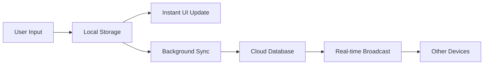
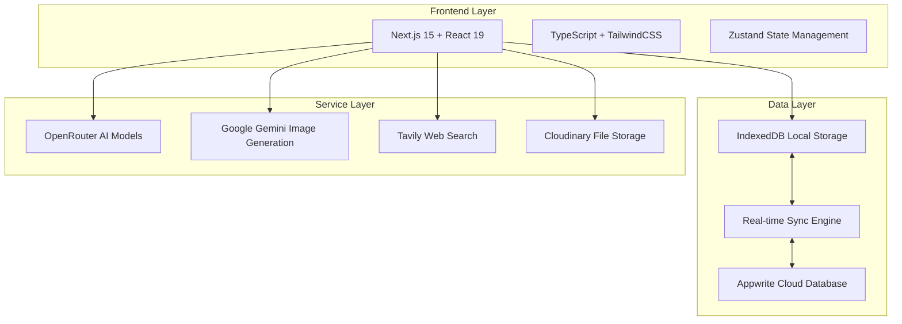
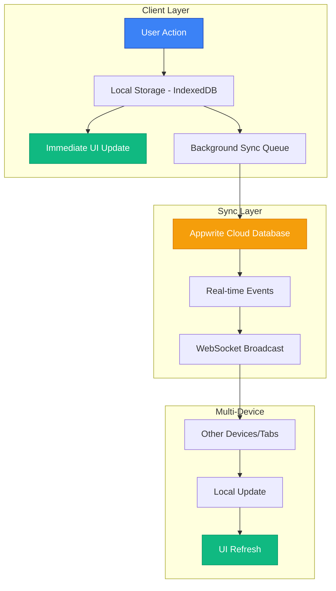

<div align="center">

# 🚀CappyChat

### _Next-Generation AI Chat Platform_

[](https://github.com/CyberBoyAyush/CappyChat)
[](LICENSE)
[](https://nextjs.org/)
[](https://www.typescriptlang.org/)
[](https://appwrite.io/)

---

**🎯 High-Performance • 🔄 Real-Time Sync • 🤖 25+ AI Models • ⚡ Sub-100ms Response**

[**🌐 Live Demo**](https://cappychat.com) • [**📚 Documentation**](docs/Project.md) • [**🔧 API Reference**](#api-documentation) • [**🤝 Contributing**](#contributing)

---

</div>

## 🎉 **What's New in v4.1.0**

> **Plan Mode & Advanced Features** - CappyChat v4.1.0 introduces Plan Mode for creating interactive diagrams and visualizations, enhanced observability with Better Stack logging, and persistent guest rate limiting with Upstash Redis.

**🌟 Highlights:**
- 🧠 **Plan Mode with AI Artifacts** - Create interactive diagrams, flowcharts, and visualizations using Mermaid
- 🌐 **URL Retrieval Tool** - Comprehensive web content analysis with live crawling and AI summaries
- 🛡️ **Upstash Redis Rate Limiting** - Persistent guest rate limiting across serverless functions
- 📊 **Better Stack Logging** - Enhanced observability with structured logging across all API endpoints
- 📄 **PDF Thumbnail Preview** - Better file visualization and management
- 🎨 **Enhanced Image Generation** - New models for improved visual content creation

[**📋 View Full Changelog**](CHANGELOG.md) • [**🚀 Upgrade Guide**](docs/Project.md)

---

## 📖 **Overview**

> **CappyChat** is a cutting-edge AI chat platform engineered for **performance**, **scalability**, and **seamless user experience**. Built with a **local-first architecture**, it delivers instant responses while maintaining data consistency across devices through intelligent cloud synchronization.

### ✨ **Key Highlights**

<table>
<tr>
<td width="50%">

**🤖 AI Excellence**

- **30+ Premium Models** - GPT-5, Gemini 2.5, Claude 4, Grok 4, DeepSeek, Qwen
- **Intelligent Routing** - Automatic model selection based on query type
- **BYOK Support** - Enhanced privacy with your own API keys
- **Tiered Access** - Free, premium, and super-premium model tiers

</td>
<td width="50%">

**⚡ Performance**

- **Sub-100ms Response** - Local-first operations with optimistic updates
- **Real-time Sync** - Instant synchronization across all devices
- **Hybrid Architecture** - IndexedDB + Appwrite cloud integration
- **106kB Bundle** - Highly optimized with dynamic imports

</td>
</tr>
<tr>
<td width="50%">

**🎨 Advanced Features**

- **Plan Mode** - Interactive diagrams and visualizations with Mermaid syntax
- **Image Generation** - Google Gemini 2.5 Flash Image Preview (nano banana)
- **Voice Input** - OpenAI Whisper speech-to-text integration
- **Web Search** - Intelligent tool calling with Parallel AI, Tavily, and Exa
- **File Upload** - Multi-format support with AI analysis, PDF thumbnails, and pagination

</td>
<td width="50%">

**🔧 Developer Experience**

- **Modern Stack** - Next.js 15, React 19, TypeScript, TailwindCSS
- **Real-time Features** - WebSocket connections with Appwrite
- **Observability** - Better Stack logging for enhanced monitoring
- **Production Ready** - Deployed at [cappychat.com](https://cappychat.com)
- **99.9% Uptime** - Enterprise-grade reliability

</td>
</tr>
</table>

---

## 👥 **Team**

<div align="center">

|                **Ayush Sharma**                |              **Vranda Garg**               |
| :--------------------------------------------: | :----------------------------------------: |
|          _Lead Developer & Architect_          |   _UI/UX Designer & Frontend Developer_    |
| Full-stack development and system architecture | User interface design and user experience  |
|  AI integration and performance optimization   | Frontend development and responsive design |
| Database design and real-time synchronization  |  Design system and component architecture  |

</div>

---

## 🌟 **Features**

<div align="center">

### _Comprehensive AI Platform with Enterprise-Grade Performance_

</div>

<details>
<summary><strong>🤖 Multi-Model AI Support</strong></summary>

<br>

| Feature                | Description                                 | Models                                        |
| ---------------------- | ------------------------------------------- | --------------------------------------------- |
| **Premium Models**     | Latest AI models with advanced capabilities | GPT-5, Claude 4, Grok 4                       |
| **Fast Models**        | Optimized for speed and efficiency          | Gemini 2.5 Flash Lite, OpenAI 5 Mini, Grok 4 Fast |
| **Specialized Models** | Task-specific AI models                     | DeepSeek R1, Qwen3 Max, Claude Sonnet 3.7     |
| **Image Models**       | Advanced image generation                   | Gemini 2.5 Flash Image Preview (nano banana)  |

**Key Benefits:**

- 🎯 **Intelligent Routing** - Automatic model selection based on query complexity
- 🔐 **BYOK Support** - Enhanced privacy with your own API keys
- 💳 **Flexible Pricing** - Tiered access with free, premium, and super-premium models
- 🔄 **Model Switching** - Seamless switching between models mid-conversation

</details>

<details>
<summary><strong>⚡ Performance & Architecture</strong></summary>

<br>



**Performance Metrics:**

- ⚡ **Sub-100ms** local operations
- 📦 **106kB** optimized bundle size
- 🔄 **99.9%** sync reliability
- 📱 **Mobile-first** responsive design

**Architecture Highlights:**

- 🏠 **Local-First Design** - IndexedDB for instant responses
- ☁️ **Hybrid Database** - Appwrite cloud synchronization
- 🔄 **Optimistic Updates** - Immediate UI feedback
- 📊 **Smart Caching** - Intelligent cache management

</details>

<details>
<summary><strong>🎨 Advanced Capabilities</strong></summary>

<br>

| Capability           | Technology                          | Features                                        |
| -------------------- | ----------------------------------- | ----------------------------------------------- |
| **Plan Mode**        | Mermaid + AI Artifacts              | Interactive diagrams, Flowcharts, Visualizations |
| **Image Generation** | Gemini 2.5 Flash Image Preview      | Text-to-image, Context-aware generation         |
| **Voice Input**      | OpenAI Whisper                      | Multi-language, Real-time transcription         |
| **Web Search**       | Parallel AI + Tavily + Exa          | Intelligent tool calling, Rich citations, Website retrieval |
| **File Upload**      | Cloudinary                          | Images, PDFs with thumbnails, Documents with AI analysis |
| **Collaboration**    | Real-time sync                      | Team workspaces, Member management              |
| **Observability**    | Better Stack + Upstash Redis        | Structured logging, Persistent rate limiting    |

**Advanced Features:**

- 🧠 **Plan Mode** - Create diagrams, flowcharts, and MVPs with AI assistance
- 🎭 **Conversation Styles** - Balanced, creative, precise modes
- 🧠 **Global Memory** - Persistent context across conversations
- 💬 **Suggested Questions** - AI-powered conversation suggestions
- 📊 **Analytics** - Usage tracking and insights with Better Stack
- 🔗 **Share & Export** - Public sharing and data export
- 🛡️ **Rate Limiting** - Persistent guest rate limiting with Upstash Redis

</details>

<details>
<summary><strong>🔧 Developer Experience</strong></summary>

<br>

**Modern Technology Stack:**

```typescript
const techStack = {
  frontend: ["Next.js 15", "React 19", "TypeScript 5.8", "TailwindCSS 4.1"],
  backend: ["Node.js", "Appwrite", "API Routes"],
  database: ["IndexedDB", "Appwrite Cloud", "Real-time Sync", "Upstash Redis"],
  deployment: ["Vercel", "Docker", "CDN"],
  monitoring: ["Better Stack", "Analytics", "Error Tracking", "Performance Metrics"],
};
```

**Developer Tools:**

- 🛠️ **TypeScript** - Full type safety with strict mode
- 🎨 **Component Library** - Shadcn/ui + Radix UI primitives
- 📦 **State Management** - Zustand for efficient state handling
- 🔐 **Authentication** - Appwrite Auth with OAuth providers
- 👑 **Admin Panel** - Comprehensive system management

</details>

---

## 🛠️ **Technology Stack**

<div align="center">

### _Built with Modern, Production-Ready Technologies_

</div>

<table>
<tr>
<td width="50%">

### **🎨 Frontend**

```typescript
{
  "framework": "Next.js 15.3",
  "runtime": "React 19",
  "language": "TypeScript 5.8",
  "styling": "TailwindCSS 4.1",
  "components": "Shadcn/ui + Radix",
  "state": "Zustand",
  "routing": "React Router 7.6",
  "forms": "React Hook Form + Zod"
}
```

### **🔧 Development**

```json
{
  "packageManager": "pnpm",
  "buildTool": "Turbopack",
  "linting": "ESLint + Next.js",
  "formatting": "Prettier",
  "versioning": "Semantic + Changelog"
}
```

</td>
<td width="50%">

### **⚙️ Backend & APIs**

```typescript
{
  "runtime": "Node.js",
  "framework": "Next.js API Routes",
  "database": "Appwrite Cloud",
  "auth": "Appwrite + OAuth",
  "storage": "Cloudinary",
  "ai": ["OpenRouter", "OpenAI", "Google Gemini"],
  "search": ["Parallel AI", "Tavily", "Exa"],
  "payments": "DODO Payments",
  "logging": "Better Stack",
  "rateLimit": "Upstash Redis"
}
```

### **💾 Data & Sync**

```json
{
  "local": "IndexedDB + Dexie.js",
  "cloud": "Appwrite Database",
  "sync": "Hybrid Local-First",
  "realtime": "WebSocket + Streaming",
  "caching": "Multi-layer TTL"
}
```

</td>
</tr>
</table>

### **🏗️ Architecture Overview**



---

## 🚀 **Getting Started**

<div align="center">

### _Get CappyChat running in under 5 minutes_

</div>

### **📋 Prerequisites**

<table>
<tr>
<td width="25%"><strong>🟢 Node.js 18+</strong></td>
<td width="75%">Download from <a href="https://nodejs.org/">nodejs.org</a></td>
</tr>
<tr>
<td width="25%"><strong>📦 pnpm</strong></td>
<td width="75%"><code>npm install -g pnpm</code></td>
</tr>
<tr>
<td width="25%"><strong>☁️ Appwrite Account</strong></td>
<td width="75%">Sign up at <a href="https://appwrite.io/">appwrite.io</a></td>
</tr>
<tr>
<td width="25%"><strong>🔑 API Keys</strong></td>
<td width="75%">Optional for basic setup, required for full features</td>
</tr>
</table>

### **⚡ Quick Start**

<details>
<summary><strong>🔧 Step 1: Clone & Install</strong></summary>

```bash
# Clone the repository
git clone https://github.com/CyberBoyAyush/CappyChat.git
cd CappyChat

# Install dependencies
pnpm install
```

</details>

<details>
<summary><strong>🌍 Step 2: Environment Setup</strong></summary>

```bash
# Copy environment template
cp env.example .env.local

# Edit with your configuration
nano .env.local  # or your preferred editor
```

</details>

<details>
<summary><strong>🗄️ Step 3: Database Configuration</strong></summary>

```bash
# Automated setup (recommended)
pnpm run setup-appwrite

# Or configure manually (see Database Setup section)
```

</details>

<details>
<summary><strong>🎯 Step 4: Launch Application</strong></summary>

```bash
# Start development server
pnpm dev

# Open in browser
open http://localhost:3000
```

</details>

> **🎉 Success!** Your CappyChat instance should now be running at [http://localhost:3000](http://localhost:3000)

### Environment Configuration

Create a `.env.local` file in your project root with the following variables:

#### Required Configuration

```env
# Appwrite Configuration
NEXT_PUBLIC_APPWRITE_ENDPOINT=https://cloud.appwrite.io/v1
NEXT_PUBLIC_APPWRITE_PROJECT_ID=your-project-id
NEXT_PUBLIC_APPWRITE_DATABASE_ID=your-database-id

# Collection IDs
NEXT_PUBLIC_APPWRITE_THREADS_COLLECTION_ID=threads
NEXT_PUBLIC_APPWRITE_MESSAGES_COLLECTION_ID=messages
NEXT_PUBLIC_APPWRITE_MESSAGE_SUMMARIES_COLLECTION_ID=message_summaries
NEXT_PUBLIC_APPWRITE_PROJECTS_COLLECTION_ID=projects
NEXT_PUBLIC_APPWRITE_GLOBAL_MEMORY_COLLECTION_ID=global_memory

# Server-side API Key (for admin operations)
APPWRITE_API_KEY=your-server-api-key

# Authentication URLs
NEXT_PUBLIC_AUTH_SUCCESS_URL=http://localhost:3000/auth/callback
NEXT_PUBLIC_AUTH_FAILURE_URL=http://localhost:3000/auth/error
NEXT_PUBLIC_VERIFICATION_URL=http://localhost:3000/auth/verify

# Admin Configuration
ADMIN_SECRET_KEY=your-secure-admin-key
```

#### Optional AI Services

```env
# OpenRouter (for multiple AI models)
OPENROUTER_API_KEY=your-openrouter-key
# Get from: https://openrouter.ai/settings/keys

# OpenAI (for Whisper voice transcription)
OPENAI_API_KEY=your-openai-key
# Get from: https://platform.openai.com/api-keys

# Tavily (for web search)
TAVILY_API_KEY=your-tavily-key
# Get from: https://tavily.com/

# Cloudinary (for file uploads)
NEXT_PUBLIC_CLOUDINARY_CLOUD_NAME=your-cloud-name
CLOUDINARY_API_KEY=your-cloudinary-key
CLOUDINARY_API_SECRET=your-cloudinary-secret
# Get from: https://cloudinary.com/console
```

#### Development Settings

```env
NODE_ENV=development
NEXT_PUBLIC_API_BASE_URL=http://localhost:3000
```

> **Note**: For production deployment, update URLs to your domain and set `NODE_ENV=production`.

### Database Setup

CappyChat uses Appwrite as the primary database with local IndexedDB for performance. Follow these steps to set up your database:

#### 1. Create Appwrite Project

1. Sign up at [Appwrite Cloud](https://cloud.appwrite.io/) or set up self-hosted instance
2. Create a new project and note the Project ID
3. Create a new database and note the Database ID

#### 2. Create Collections

Create the following collections with exact names and attributes:

**Threads Collection** (`threads`)

```typescript
{
  threadId: string,        // required, unique
  userId: string,          // required
  title: string,           // required
  updatedAt: datetime,     // required
  lastMessageAt: datetime, // required
  isPinned: boolean,       // optional, default: false
  tags: string[],          // optional
  isBranched: boolean,     // optional, default: false
  projectId: string,       // optional
  isShared: boolean,       // optional, default: false
  shareId: string,         // optional
  sharedAt: datetime       // optional
}
```

**Messages Collection** (`messages`)

```typescript
{
  messageId: string,       // required, unique
  threadId: string,        // required
  userId: string,          // required
  content: string,         // required
  role: string,            // required: "user" | "assistant" | "system" | "data"
  createdAt: datetime,     // required
  webSearchResults: string[], // optional
  attachments: string,     // optional, JSON string
  model: string,           // optional
  imgurl: string          // optional
}
```

**Projects Collection** (`projects`)

```typescript
{
  projectId: string,       // required, unique
  userId: string,          // required
  name: string,            // required
  description: string,     // optional
  prompt: string,          // optional
  colorIndex: number,      // optional
  members: string[],       // optional, array of user IDs
  createdAt: datetime,     // required
  updatedAt: datetime      // required
}
```

**Message Summaries Collection** (`message_summaries`)

```typescript
{
  summaryId: string,       // required, unique
  threadId: string,        // required
  messageId: string,       // required
  userId: string,          // required
  content: string,         // required
  createdAt: datetime      // required
}
```

**Global Memory Collection** (`global_memory`)

```typescript
{
  userId: string,          // required
  memories: string[],      // required
  enabled: boolean,        // required, default: false
  createdAt: datetime,     // required
  updatedAt: datetime      // required
}
```

#### 3. Configure Authentication

1. **Enable Authentication Methods**

   - Email/Password authentication
   - OAuth providers (Google, GitHub) - optional

2. **Set Collection Permissions**
   - **Read/Write**: Authenticated users only
   - **Document-level security**: Users can only access their own data
   - **Create permissions**: Authenticated users
   - **Update/Delete permissions**: Document owners only

#### 4. Create Database Indexes

For optimal performance, create these indexes in your Appwrite console:

```sql
-- Threads Collection
CREATE INDEX idx_threads_user_lastmessage ON threads(userId, lastMessageAt DESC)
CREATE INDEX idx_threads_user_pinned ON threads(userId, isPinned)
CREATE INDEX idx_threads_project ON threads(projectId)

-- Messages Collection
CREATE INDEX idx_messages_thread_created ON messages(threadId, createdAt ASC)
CREATE INDEX idx_messages_user_thread ON messages(userId, threadId)

-- Projects Collection
CREATE INDEX idx_projects_user_updated ON projects(userId, updatedAt DESC)

-- Message Summaries Collection
CREATE INDEX idx_summaries_thread ON message_summaries(threadId, createdAt ASC)
```

#### 5. Enable Realtime

1. Navigate to your Appwrite project settings
2. Enable **Realtime** for all collections
3. Configure WebSocket connections for live updates

#### Automated Setup (Optional)

For convenience, you can use the automated setup script:

```bash
pnpm run setup-appwrite
```

This script will create the database structure automatically using your environment configuration.

### Running the Application

Start the development server:

```bash
pnpm dev
```

The application will be available at [http://localhost:3000](http://localhost:3000).

### Available Scripts

```bash
# Development
pnpm dev              # Start development server with Turbopack
pnpm build            # Build for production
pnpm start            # Start production server
pnpm lint             # Run ESLint

# Database
pnpm setup-appwrite   # Automated database setup

# Version Management
pnpm tag-version      # Create version tag
pnpm update-changelog # Update changelog

# Analysis
pnpm build:analyze    # Analyze bundle size
```

---

## 🏗️ **Architecture**

<div align="center">

### _Hybrid Local-First Architecture for Maximum Performance_

</div>

### **🔄 Hybrid Database System**

<details>
<summary><strong>📊 System Overview</strong></summary>

<br>



</details>

<details>
<summary><strong>⚡ Local-First Operations</strong></summary>

<br>

| Component              | Technology            | Performance | Features                       |
| ---------------------- | --------------------- | ----------- | ------------------------------ |
| **Primary Storage**    | IndexedDB + Dexie.js  | Sub-100ms   | Structured data, transactions  |
| **Optimistic Updates** | React State + Zustand | Instant     | Immediate UI feedback          |
| **Offline Support**    | Service Worker        | 100%        | Full functionality offline     |
| **Smart Caching**      | Custom TTL System     | Intelligent | Auto-invalidation, compression |

**Benefits:**

- 🚀 **Instant Response** - No waiting for network requests
- 📱 **Offline First** - Works without internet connection
- 🔄 **Conflict Resolution** - Automatic data conflict handling
- 💾 **Efficient Storage** - Optimized data structures

</details>

<details>
<summary><strong>☁️ Cloud Synchronization</strong></summary>

<br>

```typescript
// Sync Strategy Implementation
const syncStrategy = {
  immediate: ["user_actions", "critical_data"],
  batched: ["analytics", "preferences"],
  background: ["cache_updates", "cleanup"],
  realtime: ["messages", "collaboration"],
};
```

**Key Features:**

- 🔄 **Background Sync** - Non-blocking synchronization with retry logic
- 🌐 **Cross-Device Sync** - Real-time updates across all user devices
- ⚡ **WebSocket Events** - Persistent connections for instant updates
- 🔒 **Conflict Resolution** - Automatic handling of data conflicts

</details>

### **🚀 Performance Optimizations**

<details>
<summary><strong>📦 Bundle Optimization</strong></summary>

<br>

| Optimization     | Result        | Technique                       |
| ---------------- | ------------- | ------------------------------- |
| **Bundle Size**  | 106kB         | Dynamic imports, code splitting |
| **Initial Load** | <1.2s         | Critical path optimization      |
| **Tree Shaking** | 40% reduction | Unused code elimination         |
| **Compression**  | 70% smaller   | Gzip + Brotli compression       |

```typescript
// Dynamic Import Example
const LazyComponent = lazy(() =>
  import("./HeavyComponent").then((module) => ({
    default: module.HeavyComponent,
  }))
);
```

</details>

<details>
<summary><strong>⚡ Runtime Performance</strong></summary>

<br>

**Performance Metrics:**

- 🎯 **First Contentful Paint**: <1.2s
- 📊 **Largest Contentful Paint**: <2.5s
- 🔄 **Cumulative Layout Shift**: <0.1
- ⚡ **First Input Delay**: <100ms
- 🚀 **Time to Interactive**: <3.0s

**Optimization Techniques:**

- 🔄 **Optimistic Updates** - Immediate UI feedback
- 📜 **Virtual Scrolling** - Efficient large list rendering
- 🧠 **Memoization** - Strategic React.memo and useMemo
- 📦 **Lazy Loading** - Dynamic imports for heavy components

</details>

## API Documentation

### Core Endpoints

#### Chat & Messaging

- `POST /api/chat-messaging` - Main chat endpoint with streaming support
- `POST /api/ai-text-generation` - Title generation and text enhancement
- `POST /api/speech-to-text` - Voice input transcription using Whisper

#### Image Generation

- `POST /api/image-generation` - Image generation using OpenRouter with Google Gemini
  - Context-aware image generation with conversation history
  - Model: Gemini 2.5 Flash Image Preview (nano banana)
  - Automatic upload to Cloudinary for storage

#### Search & Information

- `POST /api/web-search` - Intelligent web search with model-driven tool calling
  - **Tool System**: AI model automatically selects appropriate tools
  - **Web Search**: Parallel AI multi-query search with Tavily image support
  - **Retrieval**: Exa live website crawling with AI-powered summaries
  - **Weather**: OpenWeather API with comprehensive weather data
  - **Greeting**: Lightweight responses for casual greetings
- `POST /api/reddit-search` - Reddit-specific search functionality
- `POST /api/study-mode` - Enhanced study mode with PDF parsing and web search
- `POST /api/plan-mode` - Plan Mode for creating diagrams and MVPs with AI artifacts

#### File Management

- `POST /api/upload` - File upload to Cloudinary
- `POST /api/files` - List user files
- `DELETE /api/files` - Delete user files

#### Admin Operations

- `POST /api/admin/stats` - System statistics and metrics
- `POST /api/admin/manage-user` - User management operations
- `POST /api/admin/reset-limits` - Reset user credit limits
- `POST /api/admin/delete-data` - Data cleanup operations
- `POST /api/admin/bulk-operations` - Bulk administrative tasks

### Request/Response Examples

#### Chat Messaging

```typescript
// Request
POST /api/chat-messaging
{
  "messages": [
    {
      "role": "user",
      "content": "Hello, how are you?"
    }
  ],
  "model": "Gemini 2.5 Flash",
  "conversationStyle": "balanced",
  "userId": "user123",
  "isGuest": false
}

// Response (Streaming)
data: {"type":"text","text":"Hello! I'm doing well, thank you for asking."}
data: {"type":"finish","usage":{"promptTokens":10,"completionTokens":12}}
```

#### Image Generation

```typescript
// Request
POST /api/image-generation
{
  "prompt": "A beautiful sunset over mountains",
  "conversationHistory": [...], // Optional: for context-aware generation
  "userId": "user123"
}

// Response
{
  "success": true,
  "imageUrl": "https://res.cloudinary.com/...",
  "model": "Gemini 2.5 Flash Image Preview"
}
```

### Database Schema

#### User Preferences

```typescript
interface UserPreferences {
  tier: "free" | "premium" | "admin";
  freeCredits: number; // Free tier: 80, Premium: 1200
  premiumCredits: number; // Free tier: 10, Premium: 600
  superPremiumCredits: number; // Free tier: 2, Premium: 50
  lastResetDate?: string;
  customProfile?: {
    customName?: string;
    aboutUser?: string;
  };
  subscription?: {
    tier: "FREE" | "PREMIUM";
    status: "active" | "cancelled" | "expired";
    customerId?: string;
    subscriptionId?: string;
    currentPeriodEnd?: string;
    cancelAtPeriodEnd?: boolean;
  };
}
```

#### Thread Interface

```typescript
interface Thread {
  id: string;
  userId: string;
  title: string;
  createdAt: Date;
  updatedAt: Date;
  lastMessageAt: Date;
  isPinned: boolean;
  tags: string[];
  isBranched: boolean;
  projectId?: string;
  isShared?: boolean;
  shareId?: string;
  sharedAt?: Date;
}
```

#### Message Interface

```typescript
interface DBMessage {
  id: string;
  threadId: string;
  content: string;
  role: "user" | "assistant" | "system" | "data";
  createdAt: Date;
  webSearchResults?: string[];
  webSearchImgs?: string[]; // Web search image URLs
  attachments?: FileAttachment[];
  model?: string;
  imgurl?: string;
  isPlan?: boolean; // Indicates Plan Mode message
}
```

#### Project Interface

```typescript
interface Project {
  id: string;
  name: string;
  description?: string;
  prompt?: string;
  colorIndex?: number;
  members?: string[]; // Array of user IDs
  createdAt: Date;
  updatedAt: Date;
}
```

#### Plan Artifact Interface

```typescript
interface PlanArtifact {
  id: string;
  artifactId: string;
  threadId: string;
  messageId: string;
  userId: string;
  type: "mvp" | "diagram";
  title: string;
  description?: string;
  version: number;

  // MVP fields
  htmlCode?: string;
  cssCode?: string;
  jsCode?: string;
  framework?: "vanilla" | "react" | "svelte" | "vue";
  theme?: "light" | "dark";

  // Diagram fields
  diagramType?: "erd" | "flowchart" | "sequence" | "architecture" | "state_machine" | "user_journey";
  diagramCode?: string; // Mermaid syntax
  outputFormat?: "mermaid";
  sqlSchema?: string;
  prismaSchema?: string;

  isPublic?: boolean;
  createdAt: Date;
  updatedAt: Date;
}
```

## Deployment

### Vercel (Recommended)

CappyChat is optimized for deployment on Vercel with automatic builds and deployments.

1. **Fork the repository** to your GitHub account

2. **Connect to Vercel**

   - Visit [vercel.com](https://vercel.com) and sign in
   - Import your forked repository
   - Vercel will automatically detect the Next.js configuration

3. **Configure Environment Variables**

   - Add all environment variables from your `.env.local`
   - Ensure production URLs are used (not localhost)
   - Set `NODE_ENV=production`

4. **Deploy**

   ```bash
   # Manual deployment
   vercel --prod

   # Or push to main branch for automatic deployment
   git push origin main
   ```

### Docker Deployment

Create a `Dockerfile` in the project root:

```dockerfile
FROM node:18-alpine AS base

# Install dependencies only when needed
FROM base AS deps
RUN apk add --no-cache libc6-compat
WORKDIR /app

# Install dependencies based on the preferred package manager
COPY package.json pnpm-lock.yaml* ./
RUN npm install -g pnpm && pnpm install --frozen-lockfile

# Rebuild the source code only when needed
FROM base AS builder
WORKDIR /app
COPY --from=deps /app/node_modules ./node_modules
COPY . .

RUN npm install -g pnpm && pnpm build

# Production image, copy all the files and run next
FROM base AS runner
WORKDIR /app

ENV NODE_ENV production

RUN addgroup --system --gid 1001 nodejs
RUN adduser --system --uid 1001 nextjs

COPY --from=builder /app/public ./public
COPY --from=builder --chown=nextjs:nodejs /app/.next/standalone ./
COPY --from=builder --chown=nextjs:nodejs /app/.next/static ./.next/static

USER nextjs

EXPOSE 3000

ENV PORT 3000
ENV HOSTNAME "0.0.0.0"

CMD ["node", "server.js"]
```

Build and run:

```bash
docker build -t cappychat .
docker run -p 3000:3000 cappychat
```

### VPS Deployment

#### Dokploy (Recommended for VPS)

[Dokploy](https://dokploy.com/) is a modern deployment platform for VPS servers.

1. **Install Dokploy on your VPS**

   ```bash
   curl -sSL https://dokploy.com/install.sh | sh
   ```

2. **Create New Application**

   - Access Dokploy dashboard at `https://your-vps-ip:3000`
   - Create new application from GitHub repository
   - Select Node.js/Next.js template

3. **Configure Environment**

   - Add all environment variables from `.env.local`
   - Set build command: `pnpm build`
   - Set start command: `pnpm start`

4. **Deploy**
   - Dokploy will automatically build and deploy
   - SSL certificates are handled automatically
   - Monitor logs and metrics from dashboard

#### Coolify

[Coolify](https://coolify.io/) is an open-source alternative to Heroku for VPS.

1. **Install Coolify**

   ```bash
   curl -fsSL https://cdn.coollabs.io/coolify/install.sh | bash
   ```

2. **Setup Application**

   - Access Coolify at `https://your-vps-ip:8000`
   - Connect GitHub repository
   - Configure as Node.js application

3. **Environment Configuration**

   ```bash
   # Add environment variables in Coolify dashboard
   NODE_ENV=production
   NEXT_PUBLIC_API_BASE_URL=https://yourdomain.com
   # ... other variables
   ```

4. **Deploy & Monitor**
   - Automatic deployments on git push
   - Built-in monitoring and logging
   - SSL certificates via Let's Encrypt

#### Manual VPS Setup

For advanced users who prefer manual setup:

```bash
# Install Node.js and pnpm
curl -fsSL https://deb.nodesource.com/setup_18.x | sudo -E bash -
sudo apt-get install -y nodejs
npm install -g pnpm pm2

# Clone and setup
git clone https://github.com/CyberBoyAyush/CappyChat.git
cd CappyChat
pnpm install
pnpm build

# Start with PM2
pm2 start ecosystem.config.js
pm2 startup
pm2 save
```

### Other Platforms

**Netlify**

- Set build command: `pnpm build`
- Set publish directory: `.next`
- Add environment variables in Netlify dashboard

**Railway**

- Connect GitHub repository
- Railway auto-detects Next.js configuration
- Add environment variables in Railway dashboard

**DigitalOcean App Platform**

- One-click deployment from GitHub
- Automatic scaling and SSL
- Built-in monitoring and alerts

### Production Configuration

#### Environment Variables for Production

Update these variables for production deployment:

```env
# Production URLs
NEXT_PUBLIC_AUTH_SUCCESS_URL=https://yourdomain.com/auth/callback
NEXT_PUBLIC_AUTH_FAILURE_URL=https://yourdomain.com/auth/error
NEXT_PUBLIC_VERIFICATION_URL=https://yourdomain.com/auth/verify
NEXT_PUBLIC_API_BASE_URL=https://yourdomain.com

# Production settings
NODE_ENV=production

# Security
ADMIN_SECRET_KEY=your-production-admin-key
```

#### Performance Optimizations

- **CDN**: Vercel/Cloudflare automatically provides global CDN
- **Caching**: Configure appropriate cache headers
- **Monitoring**: Set up error tracking and performance monitoring
- **SSL**: Automatic HTTPS with most platforms or configure SSL certificates
- **Load Balancing**: Use nginx or platform load balancers for high traffic

#### VPS-Specific Optimizations

```nginx
# Nginx configuration for VPS deployment
server {
    listen 80;
    server_name yourdomain.com;
    return 301 https://$server_name$request_uri;
}

server {
    listen 443 ssl http2;
    server_name yourdomain.com;

    ssl_certificate /path/to/certificate.crt;
    ssl_certificate_key /path/to/private.key;

    location / {
        proxy_pass http://localhost:3000;
        proxy_http_version 1.1;
        proxy_set_header Upgrade $http_upgrade;
        proxy_set_header Connection 'upgrade';
        proxy_set_header Host $host;
        proxy_set_header X-Real-IP $remote_addr;
        proxy_set_header X-Forwarded-For $proxy_add_x_forwarded_for;
        proxy_set_header X-Forwarded-Proto $scheme;
        proxy_cache_bypass $http_upgrade;
    }
}
```

#### PM2 Ecosystem Configuration

Create `ecosystem.config.js` for PM2 process management:

```javascript
module.exports = {
  apps: [
    {
      name: "cappychat",
      script: "server.js",
      instances: "max",
      exec_mode: "cluster",
      env: {
        NODE_ENV: "production",
        PORT: 3000,
      },
      error_file: "./logs/err.log",
      out_file: "./logs/out.log",
      log_file: "./logs/combined.log",
      time: true,
    },
  ],
};
```

## Development

### Project Structure

```
CappyChat/
├── app/                          # Next.js App Router
│   ├── api/                      # Backend API routes
│   │   ├── admin/                # Admin endpoints
│   │   ├── chat-messaging/       # Main chat API
│   │   ├── image-generation/     # Image generation
│   │   ├── speech-to-text/       # Voice input
│   │   ├── upload/               # File uploads
│   │   └── web-search/           # Search functionality
│   ├── layout.tsx                # Root layout
│   └── static-app-shell/         # SPA shell
├── frontend/                     # React application
│   ├── components/               # Reusable UI components
│   ├── contexts/                 # React contexts
│   ├── hooks/                    # Custom hooks
│   ├── routes/                   # Page components
│   └── stores/                   # Zustand stores
├── lib/                          # Core utilities
│   ├── appwrite*.ts              # Appwrite services
│   ├── hybridDB.ts               # Local-first database
│   ├── models.ts                 # AI model configurations
│   ├── tierSystem.ts             # User tier management
│   └── streamingSync.ts          # Real-time sync
├── docs/                         # Documentation
├── public/                       # Static assets
└── scripts/                      # Build and utility scripts
```

### Code Standards

#### TypeScript Configuration

- **Strict Mode**: Full TypeScript strict mode enabled
- **Type Safety**: Comprehensive type definitions for all APIs
- **Interface Design**: Clear interfaces for all data structures
- **Generic Types**: Reusable generic types for common patterns

#### Component Architecture

```typescript
// Functional components with TypeScript
interface ChatMessageProps {
  message: DBMessage;
  onEdit?: (messageId: string) => void;
  onDelete?: (messageId: string) => void;
}

const ChatMessage: React.FC<ChatMessageProps> = ({
  message,
  onEdit,
  onDelete,
}) => {
  // Component implementation
};
```

#### State Management Patterns

```typescript
// Zustand store pattern
interface ChatStore {
  messages: DBMessage[];
  activeThread: string | null;
  addMessage: (message: DBMessage) => void;
  setActiveThread: (threadId: string) => void;
}

const useChatStore = create<ChatStore>((set) => ({
  messages: [],
  activeThread: null,
  addMessage: (message) =>
    set((state) => ({
      messages: [...state.messages, message],
    })),
  setActiveThread: (threadId) => set({ activeThread: threadId }),
}));
```

### Performance Guidelines

#### Local-First Operations

```typescript
// Always prioritize local operations
const optimisticUpdate = async (data: any) => {
  // 1. Update local state immediately
  updateLocalState(data);

  // 2. Sync to cloud in background
  try {
    await syncToCloud(data);
  } catch (error) {
    handleSyncError(error);
  }
};
```

#### Bundle Optimization

- **Dynamic Imports**: Use for heavy components
- **Code Splitting**: Automatic route-based splitting
- **Tree Shaking**: Eliminate unused code
- **Package Optimization**: Selective imports from large libraries

#### Caching Strategy

- **Multi-level Caching**: Browser, service worker, application
- **Smart Invalidation**: Automatic cache invalidation
- **Progressive Loading**: Critical data first

### Testing

#### Unit Testing

```typescript
import { render, screen } from "@testing-library/react";
import { ChatMessage } from "./ChatMessage";

describe("ChatMessage", () => {
  it("renders message content correctly", () => {
    const message = {
      id: "1",
      content: "Hello world",
      role: "user" as const,
      createdAt: new Date(),
    };

    render(<ChatMessage message={message} />);
    expect(screen.getByText("Hello world")).toBeInTheDocument();
  });
});
```

#### Integration Testing

- **API Testing**: Test all API endpoints
- **Database Testing**: Test database operations
- **Real-time Testing**: Test WebSocket connections
- **Performance Testing**: Test load and response times

## Contributing

We welcome contributions from developers of all skill levels! Whether you're fixing bugs, adding features, or improving documentation, every contribution helps make CappyChat better.

### Getting Started

1. **Fork the repository** on GitHub
2. **Clone your fork** locally
   ```bash
   git clone https://github.com/your-username/CappyChat.git
   cd CappyChat
   ```
3. **Create a feature branch**
   ```bash
   git checkout -b feature/your-feature-name
   ```
4. **Install dependencies**
   ```bash
   pnpm install
   ```
5. **Set up your development environment** (see [Getting Started](#getting-started))

### Development Workflow

#### Branch Naming Convention

- `feature/description` - New features
- `bugfix/description` - Bug fixes
- `docs/description` - Documentation updates
- `refactor/description` - Code refactoring
- `test/description` - Test improvements

#### Commit Message Format

Follow [Conventional Commits](https://www.conventionalcommits.org/):

```bash
feat: add voice input support for mobile devices
fix: resolve real-time sync issue with large messages
docs: update API documentation for image generation
refactor: optimize database query performance
test: add unit tests for chat message component
```

#### Code Quality

- **TypeScript**: All code must be properly typed
- **ESLint**: Follow the project's linting rules
- **Prettier**: Use consistent code formatting
- **Testing**: Add tests for new features and bug fixes

### Pull Request Process

1. **Ensure your code follows the project standards**

   ```bash
   pnpm lint
   pnpm build
   ```

2. **Write clear commit messages** following conventional commits

3. **Update documentation** if you're adding new features

4. **Add tests** for new functionality

5. **Create a pull request** with:
   - Clear title and description
   - Reference to related issues
   - Screenshots for UI changes
   - Testing instructions

### Areas for Contribution

#### High Priority

- **Testing**: Expand test coverage for components and APIs
- **Performance**: Optimize bundle size and runtime performance
- **Accessibility**: Improve WCAG compliance and keyboard navigation
- **Mobile**: Enhance mobile user experience
- **Documentation**: Improve API documentation and guides

#### Feature Requests

- **Internationalization**: Multi-language support
- **Themes**: Additional theme options and customization
- **Integrations**: New AI model integrations
- **Collaboration**: Enhanced team collaboration features
- **Analytics**: Usage analytics and insights

### Code of Conduct

- **Be respectful** and inclusive in all interactions
- **Provide constructive feedback** in code reviews
- **Help newcomers** get started with the project
- **Follow the project's coding standards** and conventions
- **Report issues** clearly with reproduction steps

---

## 🔧 **Troubleshooting**

<div align="center">

### _Quick Solutions for Common Issues_

</div>

<details>
<summary><strong>🚨 Environment Setup Issues</strong></summary>

<br>

**❌ Application fails to start**

```bash
# Check Node.js version
node --version  # Should be 18+

# Clear and reinstall dependencies
rm -rf node_modules .next
pnpm install

# Verify environment variables
cat .env.local | grep -v "^#"
```

**✅ Solutions:**

- ✔️ Verify all required environment variables are set
- ✔️ Check Appwrite project configuration
- ✔️ Ensure Node.js version is 18 or higher
- ✔️ Clear cache and reinstall dependencies

</details>

<details>
<summary><strong>🗄️ Database Connection Issues</strong></summary>

<br>

**❌ Database operations fail**

```typescript
// Debug database connection
const testConnection = async () => {
  try {
    const result = await databases.listDocuments("main", "threads");
    console.log("✅ Database connected:", result);
  } catch (error) {
    console.error("❌ Database error:", error);
  }
};
```

**✅ Solutions:**

- ✔️ Verify Appwrite endpoint and project ID
- ✔️ Check API key permissions (databases.read, databases.write, users.read)
- ✔️ Ensure collections exist with correct names and schemas
- ✔️ Verify user authentication status

</details>

<details>
<summary><strong>🔄 Real-time Sync Issues</strong></summary>

<br>

**❌ Messages don't sync across devices**

```javascript
// Debug WebSocket connection
const debugRealtime = () => {
  console.log("WebSocket state:", client.realtime.connection.state);
  client.realtime.subscribe(
    "databases.main.collections.messages.documents",
    (response) => console.log("Realtime event:", response)
  );
};
```

**✅ Solutions:**

- ✔️ Check Appwrite Realtime is enabled
- ✔️ Verify WebSocket connections in browser dev tools
- ✔️ Check user permissions for collections
- ✔️ Clear local storage: `localStorage.clear()`

</details>

<details>
<summary><strong>⚡ Performance Issues</strong></summary>

<br>

**❌ Slow loading or high memory usage**

```bash
# Analyze bundle size
pnpm build:analyze

# Check performance metrics
pnpm lighthouse

# Monitor memory usage
# Open Chrome DevTools > Performance tab
```

**✅ Solutions:**

- ✔️ Check bundle size and optimize imports
- ✔️ Verify CDN and caching configuration
- ✔️ Monitor database query performance
- ✔️ Check for memory leaks in React components

</details>

### **🆘 Getting Help**

<table>
<tr>
<td width="25%"><strong>🐛 Bug Reports</strong></td>
<td width="75%"><a href="https://github.com/CyberBoyAyush/CappyChat/issues">GitHub Issues</a></td>
</tr>
<tr>
<td width="25%"><strong>💬 Discussions</strong></td>
<td width="75%"><a href="https://github.com/CyberBoyAyush/CappyChat/discussions">Community Q&A</a></td>
</tr>
<tr>
<td width="25%"><strong>📚 Documentation</strong></td>
<td width="75%"><a href="docs/Project.md">Comprehensive Docs</a></td>
</tr>
<tr>
<td width="25%"><strong>📧 Direct Support</strong></td>
<td width="75%"><a href="mailto:connect@ayush-sharma.in">connect@ayush-sharma.in</a></td>
</tr>
</table>

---

## 💳 **Pricing & Subscription**

<div align="center">

### _Flexible Plans for Every User_

</div>

<table>
<tr>
<td width="50%">

### **🆓 Free Tier**

Perfect for trying out CappyChat

- ✅ **80 Free Credits** - Basic AI models
- ✅ **10 Premium Credits** - Advanced models
- ✅ **2 Super Premium Credits** - Top-tier models
- ✅ **All Core Features** - Full functionality
- ✅ **Monthly Reset** - Credits refresh every month

</td>
<td width="50%">

### **👑 Premium Tier**

For power users and professionals

- ⭐ **1200 Free Credits** - 15x more basic credits
- ⭐ **600 Premium Credits** - 60x more advanced credits
- ⭐ **50 Super Premium Credits** - 25x more top-tier credits
- ⭐ **Priority Support** - Faster response times
- ⭐ **$12/month or ₹999** - Affordable pricing

</td>
</tr>
</table>

**💡 Credit Usage:**
- **Free Models** (1 credit): Gemini 2.5 Flash Lite, OpenAI 5 Mini
- **Premium Models** (1 credit): GPT-5, Claude 4, Grok 4
- **Super Premium Models** (1 credit): DeepSeek R1, Qwen3 Max
- **Image Generation Models** (10 credits): Gemini Nano Banana

[**🚀 Upgrade to Premium**](https://cappychat.com/pricing) • [**📊 View All Models**](docs/Project.md)

---

## 📄 **License**

<div align="center">

**GNU General Public License v3.0** - See the [LICENSE](LICENSE) file for details

_This project is licensed under GPL v3 with additional restrictions for commercial use_

</div>

---

## 🙏 **Acknowledgments**

<div align="center">

### _Special Thanks to Our Technology Partners_

</div>

<table>
<tr>
<td align="center" width="20%">

<br><strong>AI Models</strong>
</td>
<td align="center" width="20%">

<br><strong>Backend Infrastructure</strong>
</td>
<td align="center" width="20%">

<br><strong>Deployment & Hosting</strong>
</td>
<td align="center" width="20%">

<br><strong>Framework</strong>
</td>
<td align="center" width="20%">

<br><strong>Language</strong>
</td>
</tr>
</table>

**🌟 Special Recognition:**

- **Open Source Community** for the incredible tools and libraries
- **Beta Testers** who provided valuable feedback and bug reports
- **Contributors** who help make CappyChat better every day
- **Users** who trust CappyChat for their AI conversations

### 📋 **License Notice**

This project is licensed under **GPL v3** with additional restrictions:

- ✅ **Personal Use**: Free to use, modify, and distribute
- ✅ **Open Source Projects**: Compatible with GPL-compatible licenses
- ⚠️ **Commercial Use**: Requires explicit permission from copyright holders
- 📝 **Modifications**: Must be disclosed and properly attributed
- 🌐 **Network Deployment**: Modified versions require source code disclosure

For commercial licensing or permission requests, contact the copyright holders.

---

<div align="center">

## 🚀 **Ready to Experience the Future of AI Chat?**

[](https://cappychat.com)
[](https://github.com/CyberBoyAyush/CappyChat)
[](docs/Project.md)

---

### _Built with ❤️ by the CappyChat Team_

**Making AI conversations accessible, fast, and delightful for everyone**

---

<sub>© 2025 CappyChat. All rights reserved. | Version 4.1.0 | Made with ❤️ for the AI community</sub>

</div>
