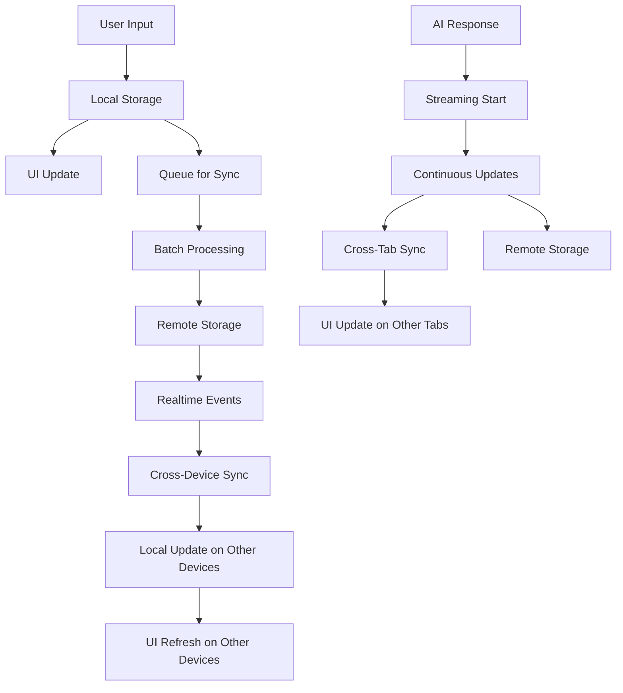

# AVChat Realtime Sync Architecture

This document outlines the comprehensive sync architecture in AVChat, detailing how messages are synchronized across devices and browser sessions.

## Sync Flow Overview

AVChat uses a local-first architecture with cloud synchronization to provide instant UI updates while maintaining data consistency across devices.



## Detailed Sync Process

### 1. User Input & Initial Processing

When a user sends a message in `ChatInputField.tsx`:

```javascript
// User submits message
const userMessage = createUserMessage(messageId, finalInput, finalAttachments);

// Store the user message immediately to the database (skip for guest users)
if (!isGuest) {
  HybridDB.createMessage(threadId, userMessage);
}

// Pass to UI with attachments
append({
  id: messageId,
  role: "user",
  content: finalInput,
  attachments: finalAttachments.length > 0 ? finalAttachments : undefined,
});
```

### 2. Local-First Storage (HybridDB)

HybridDB handles the local-first architecture:

```typescript
static async createMessage(threadId: string, message: any): Promise<void> {
  // Format message for local storage
  const dbMessage: DBMessage = {
    id: message.id,
    threadId,
    content: message.content,
    role: message.role,
    parts: message.parts || [],
    createdAt: message.createdAt || new Date(),
    webSearchResults: message.webSearchResults || undefined,
    attachments: message.attachments || undefined
  };

  // Instant local update
  LocalDB.addMessage(dbMessage);
  debouncedEmitter.emit('messages_updated', threadId, LocalDB.getMessagesByThread(threadId));
  debouncedEmitter.emit('threads_updated', LocalDB.getThreads());

  // Skip remote sync for guest users
  if (this.isGuestMode) {
    return;
  }

  // Async remote update
  this.queueSync(async () => {
    try {
      await AppwriteDB.createMessage(threadId, message);
    } catch (error) {
      console.error('Failed to sync message creation:', error);
    }
  });
}
```

### 3. Local Storage (LocalDB)

LocalDB handles immediate storage in browser's localStorage:

```typescript
static addMessage(message: DBMessage): void {
  try {
    const data = localStorage.getItem(STORAGE_KEYS.MESSAGES);
    const messages = data ? JSON.parse(data) : [];
    
    // Check if message already exists
    const existingIndex = messages.findIndex((m: any) => m.id === message.id);
    if (existingIndex >= 0) {
      messages[existingIndex] = message;
    } else {
      messages.push(message);
    }
    
    localStorage.setItem(STORAGE_KEYS.MESSAGES, JSON.stringify(messages));
    
    // Update thread's lastMessageAt
    this.updateThread(message.threadId, {
      lastMessageAt: message.createdAt,
      updatedAt: new Date()
    });
  } catch (error) {
    console.error('Error saving message to local storage:', error);
  }
}
```

### 4. Sync Queue Management

Messages are queued for sync to prevent overwhelming the server:

```typescript
private static queueSync(syncOperation: () => Promise<void>): void {
  this.syncQueue.push(syncOperation);
  this.processSyncQueue();
}

private static async processSyncQueue(): Promise<void> {
  if (this.isSyncing || this.syncQueue.length === 0) {
    return;
  }

  this.isSyncing = true;

  // Process operations in batches to reduce network congestion
  const batchSize = 3;
  while (this.syncQueue.length > 0) {
    const batch = this.syncQueue.splice(0, batchSize);
    
    try {
      // Process batch operations in parallel for better performance
      await Promise.all(batch.map(operation => operation()));
      this.isOnline = true;
    } catch (error) {
      console.error('Batch sync operation failed:', error);
      this.isOnline = false;
      // Re-queue failed operations for later retry
      this.syncQueue.unshift(...batch);
      break;
    }

    // Small delay between batches to prevent overwhelming the server
    if (this.syncQueue.length > 0) {
      await new Promise(resolve => setTimeout(resolve, 50));
    }
  }
}
```

### 5. Remote Storage (AppwriteDB)

AppwriteDB handles the cloud storage in Appwrite:

```typescript
static async createMessage(threadId: string, message: any): Promise<void> {
  try {
    const userId = await this.getCurrentUserId();
    const messageCreatedAt = message.createdAt || new Date();
    const now = new Date();
    
    // Prepare message data
    const messageData: any = {
      messageId: message.id,
      threadId: threadId,
      userId: userId,
      content: message.content,
      role: message.role,
      createdAt: messageCreatedAt.toISOString()
    };
    
    // Add web search results if present
    if (message.webSearchResults) {
      messageData.webSearchResults = JSON.stringify(message.webSearchResults);
    }
    
    // Add attachments if present (serialize to JSON string for Appwrite)
    if (message.attachments && message.attachments.length > 0) {
      messageData.attachments = JSON.stringify(message.attachments);
    }

    const messagePromise = databases.createDocument(
      DATABASE_ID,
      MESSAGES_COLLECTION_ID,
      ID.unique(),
      messageData
    );

    // Update thread timestamp in parallel
    const updateThreadPromise = this.updateThreadLastMessage(threadId, messageCreatedAt, now);

    // Execute both operations in parallel
    await Promise.all([messagePromise, updateThreadPromise]);
  } catch (error) {
    console.error('Error creating message:', error);
    throw error;
  }
}
```

### 6. Real-time Streaming Sync

For AI responses, real-time streaming sync is handled:

```typescript
updateStreamingContent(threadId: string, messageId: string, content: string): void {
  const key = `${threadId}_${messageId}`;
  const existingState = this.streamingStates.get(key);

  if (!existingState || !existingState.isStreaming) {
    return; // Not streaming or doesn't exist
  }

  const state: StreamingState = {
    ...existingState,
    content,
    lastUpdate: Date.now(),
    sessionId: this.sessionId
  };

  this.streamingStates.set(key, state);

  // Immediately notify local subscribers
  this.notifySubscribers(key, state);

  // Broadcast to other browser sessions via localStorage
  this.broadcastToOtherSessions(state);
}
```

### 7. Cross-Session Sync

For syncing across browser tabs/windows:

```typescript
private broadcastToOtherSessions(state: StreamingState): void {
  if (typeof window !== 'undefined') {
    try {
      const broadcastData = {
        state,
        timestamp: Date.now()
      };

      // Use localStorage to broadcast to other tabs/windows
      localStorage.setItem('atchat_streaming_broadcast', JSON.stringify(broadcastData));

      // Clear the broadcast after a short delay to prevent accumulation
      setTimeout(() => {
        try {
          localStorage.removeItem('atchat_streaming_broadcast');
        } catch (error) {
          // Ignore cleanup errors
        }
      }, 100);
    } catch (error) {
      console.error('[StreamingSync] Error broadcasting to other sessions:', error);
    }
  }
}
```

### 8. Appwrite Realtime

For cross-device sync, Appwrite Realtime is used:

```typescript
static subscribeToMessages(userId: string): () => void {
  console.log('[AppwriteRealtime] Subscribing to messages collection');
  const unsubscribe = client.subscribe(
    `databases.${DATABASE_ID}.collections.${MESSAGES_COLLECTION_ID}.documents`,
    (response: RealtimeResponseEvent<AppwriteMessage>) => {
      console.log('[AppwriteRealtime] Message event received:', response.events[0]);

      // Process only events for the current user
      if (response.payload?.userId !== userId) {
        console.log('[AppwriteRealtime] Message event ignored - different user');
        return;
      }

      // Handle different event types
      const eventType = response.events[0];
      
      if (eventType.includes('create')) {
        this.handleRemoteMessageCreated(response.payload);
      } else if (eventType.includes('update')) {
        this.handleRemoteMessageUpdated(response.payload);
      } else if (eventType.includes('delete')) {
        this.handleRemoteMessageDeleted(response.payload);
      }
    }
  );
  
  return unsubscribe;
}
```

### 9. Realtime Handlers

HybridDB handles incoming realtime events:

```typescript
private static handleRemoteMessageCreated(appwriteMessage: any): void {
  // Convert Appwrite message to local format
  const message: DBMessage = {
    id: appwriteMessage.messageId,
    threadId: appwriteMessage.threadId,
    content: appwriteMessage.content,
    role: appwriteMessage.role,
    parts: [{ type: 'text', text: appwriteMessage.content }],
    createdAt: new Date(appwriteMessage.createdAt),
    webSearchResults: appwriteMessage.webSearchResults ? JSON.parse(appwriteMessage.webSearchResults) : undefined,
    attachments: appwriteMessage.attachments ? JSON.parse(appwriteMessage.attachments) : undefined
  };

  LocalDB.addMessage(message);
  const updatedMessages = LocalDB.getMessagesByThread(message.threadId);
  debouncedEmitter.emitImmediate('messages_updated', message.threadId, updatedMessages);
  debouncedEmitter.emitImmediate('threads_updated', LocalDB.getThreads());
}
```

### 10. UI Updates

Finally, the UI is updated with the synced data:

```typescript
// Listen for streaming broadcasts from other sessions
const handleStreamingBroadcast = (
  broadcastThreadId: string,
  messageId: string,
  streamingState: StreamingState
) => {
  console.log(
    "[ChatInterface] Streaming broadcast received:",
    messageId,
    "chars:",
    streamingState.content.length,
    "from session:",
    streamingState.sessionId
  );

  // Only apply if it's for this thread and from another session
  if (
    broadcastThreadId === threadId &&
    streamingState.sessionId !== streamingSync.getSessionId()
  ) {
    console.log(
      "[ChatInterface] Applying streaming update from another session"
    );
    
    // Update UI with streamed content from other session
    // ...
  }
};
```

## Adding New Fields to Messages

When adding new fields to messages, follow these guidelines to maintain sync integrity:

1. Update all relevant interfaces (`AppwriteMessage`, `DBMessage`)
2. Modify serialization/deserialization logic in `AppwriteDB` and `HybridDB`
3. Update Appwrite collection schema if necessary
4. Ensure proper handling in realtime event handlers
5. Test thoroughly across multiple devices and browser sessions

## Performance Considerations

- Batch operations to reduce network load
- Use debounced events to prevent UI thrashing
- Implement proper error handling and retry mechanisms
- Monitor sync queue length to detect potential issues
- Use localStorage for cross-tab communication to reduce server load

## Troubleshooting

- Check browser console for sync-related errors
- Verify Appwrite realtime connection status
- Inspect localStorage for message data integrity
- Monitor network requests for API failures
- Check for version mismatches between local and remote data