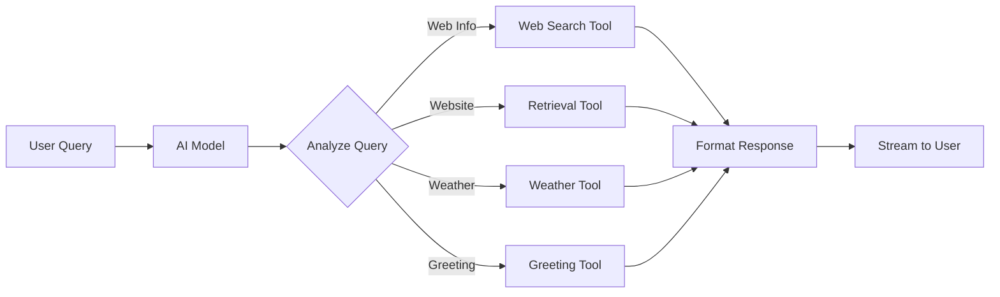
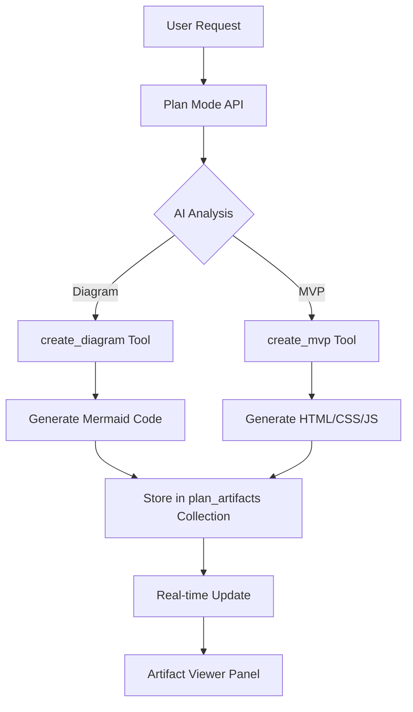

# CappyChat — Consolidated Project Documentation

## Table of Contents
1. Introduction
2. Features
3. Technology Stack
4. Getting Started
5. Project Structure
6. Architecture & Core Concepts
   - HybridDB: Local-First Database
   - Real-Time Synchronization Architecture
   - Streaming Sync
7. Performance & Bundle Optimization
   - Bundle Size Optimization Implementation
   - Comprehensive Performance Optimization (Account/API/Data Loading)
8. Image Generation System
   - Image-to-Image & Aspect Ratio Implementation Summary
   - Dimension Testing for Models
   - Aspect Ratio Persistence Fix
9. Web Search & Tool Calling System
10. Session Management & Authentication Improvements
11. Real-Time Sync Optimization
12. Automatic Data Refresh
13. API Routes
14. Frontend Components
15. State Management
16. Database Schema
17. Authentication & Security
18. File Management
19. AI Integration
20. Development Workflow
21. Deployment
22. Contributing
23. Troubleshooting
24. Recent Updates & New Features
25. Additional Resources

---

## 1) Introduction

Welcome to the comprehensive documentation for CappyChat (also referred to as AtChat), a next‑generation AI chat platform built for performance, scalability, and a seamless user experience. CappyChat integrates multiple AI models, real‑time synchronization, and a modern, responsive user interface. It is built with a local‑first architecture so it remains fast and reliable, even in offline or flaky‑network scenarios.

---

## 2) Features

- **Multi‑Model AI Support**: OpenRouter, OpenAI, Google, Anthropic, and more
- **Real‑Time Sync**: Instant synchronization of messages/threads across devices and tabs
- **Local‑First Architecture**: IndexedDB (via Dexie) for snappy UX with cloud sync
- **Plan Mode**: Create interactive diagrams, flowcharts, and MVPs with AI artifacts
  - **Mermaid Diagrams**: ERDs, flowcharts, sequence diagrams, architecture diagrams
  - **MVP Generation**: HTML/CSS/JS artifacts with multiple framework support
  - **Artifact Viewer**: Resizable side panel with zoom/pan controls
  - **Real-time Updates**: Live artifact generation and updates
- **Image Generation**: Text‑to‑image and image‑to‑image workflows
- **Voice Input**: Speech‑to‑text (OpenAI Whisper)
- **Mobile‑First Design**: Fully responsive UI
- **Project Management**: Organize chats into projects with custom prompts
- **File Uploads**: Attach files with PDF thumbnails; AI can analyze content
- **Web Search**: Intelligent tool calling system with Parallel AI, Tavily, and Exa
  - **Model-Driven**: AI automatically selects appropriate tools
  - **Web Search**: Multi-query search with image support
  - **Retrieval**: Live website crawling with AI summaries
  - **Weather**: Real-time weather data for any location
  - **Citations**: Rich, clickable citations with source links
- **Markdown & Code**: Rich Markdown, syntax highlight, math via KaTeX, Mermaid diagrams
- **Guest Mode**: Try without an account (with Upstash Redis rate limiting)
- **Authentication**: Email/password + OAuth (Google, GitHub)
- **Session Management**: Monitor/manage active sessions
- **Admin Dashboard**: Admin tools for users, limits, data
- **Observability**: Better Stack logging for enhanced monitoring and debugging

---

## 3) Technology Stack

### Frontend
- Next.js 15 with React 19
- TypeScript
- TailwindCSS + PostCSS
- Shadcn UI, Radix UI
- Zustand (state)
- React Router
- React Hook Form + Zod
- react‑markdown + remark‑gfm + rehype‑katex

### Backend
- Next.js API Routes (TypeScript)
- Appwrite Database + Realtime + Auth
- Cloudinary (uploads)
- AI: OpenRouter, OpenAI, Google Gemini
- Search: Parallel AI, Tavily, Exa
- Logging: Better Stack
- Rate Limiting: Upstash Redis

### Local Storage
- IndexedDB via Dexie.js

### Tooling
- pnpm, ESLint, Prettier, Turbopack

---

## 4) Getting Started

### Prerequisites
- Node.js 18+
- pnpm
- Appwrite instance (cloud or self‑hosted)
- API keys (OpenRouter, OpenAI, Runware, Tavily as needed)

### Install & Run
```bash
git clone https://github.com/cyberboyayush/CappyChat.git
cd CappyChat
pnpm install
cp env.example .env.local # fill in values
pnpm run setup-appwrite   # optional automated setup
pnpm dev                  # start dev server at http://localhost:3000
```

---

## 5) Project Structure

```
CappyChat/
├── app/                          # Next.js App Router
│   ├── api/                      # Backend API routes
│   │   ├── admin/                # Admin endpoints
│   │   ├── ai-text-generation/   # Title generation
│   │   ├── chat-messaging/       # Main chat API
│   │   ├── files/                # File operations
│   │   ├── image-generation/     # Image generation (Runware)
│   │   ├── speech-to-text/       # Voice input
│   │   ├── upload/               # Cloudinary upload
│   │   └── web-search/           # Tavily search
│   ├── layout.tsx
│   └── static-app-shell/
│       └── page.tsx
├── frontend/                     # React application
│   ├── components/
│   ├── contexts/
│   ├── hooks/
│   ├── routes/
│   └── stores/
├── lib/                          # Core utilities/services
│   ├── appwrite*.ts              # Appwrite client/db/realtime
│   ├── hybridDB.ts               # Local-first DB layer
│   ├── localDB.ts                # IndexedDB operations
│   ├── streamingSync.ts          # Real-time streaming sync
│   ├── models.ts                 # AI model configurations
│   ├── tierSystem.ts             # Tiers & credits
│   ├── realtimeConfig.ts         # Realtime config
│   └── ...
├── docs/                         # Documentation (this single file)
├── public/
└── ... configuration files
```

---

## 6) Architecture & Core Concepts

### HybridDB: Local‑First Database
- Instant local operations (sub‑10ms) using IndexedDB
- Background sync to Appwrite
- Conflict handling and cross‑tab/device updates
- Optimistic UI updates

Example usage:
```typescript
await HybridDB.createMessage(threadId, content, attachments);
// Immediate local update → queued cloud sync → broadcast to tabs/devices
```

### Real‑Time Synchronization Architecture

High‑level flow:
```
User Action → Local Update → UI Update → Cloud Sync → Broadcast → Other Devices
     ↓              ↓            ↓           ↓           ↓            ↓
   Instant      IndexedDB    React State  Appwrite   WebSocket   Live Updates
```

Mermaid overview:


### Streaming Sync
- Character‑by‑character AI response streaming
- Zero/low‑throttle updates for immediacy
- Cross‑tab broadcasting (localStorage/BroadcastChannel)

---

## 7) Performance & Bundle Optimization

### Bundle Size Optimization Implementation

#### Problem
- Large dependencies, duplicates (e.g., `motion` vs `framer-motion`), heavy components loaded synchronously, unused deps.

#### Solution Highlights
- Remove duplicates/unused: `@tabler/icons-react`, `motion`; standardize on `framer-motion`
- Dynamic imports for heavy components (e.g., `LazyMarkdownRenderer.tsx`, `LazySparkles.tsx`)
- Bundle analyzer enabled via `@next/bundle-analyzer`
- Optimize package imports (Next.js `optimizePackageImports`)
- Trust Next.js chunking instead of custom `splitChunks`

Example configuration:
```typescript
optimizePackageImports: [
  'lucide-react',
  'framer-motion', 
  'react-markdown',
  '@radix-ui/react-dialog',
  '@radix-ui/react-dropdown-menu',
  '@radix-ui/react-tooltip',
  '@radix-ui/react-scroll-area',
  'react-hot-toast',
  'date-fns',
]
```

Results table:

| Approach | Bundle Size | Result |
|----------|-------------|--------|
| Original | Unknown     | Baseline |
| After Dependency Cleanup | 106 kB | Excellent |
| With Custom Webpack Config | 2.12 MB | Terrible |
| Final (Trust Next.js) | 106 kB | Perfect |

Usage:
```bash
pnpm run build:analyze
pnpm run build
```

Key learnings: Prefer built‑in Next.js optimizations, lazy‑load heavy parts, keep dependencies lean.

### Comprehensive Performance Optimization (Account/API/Data Loading)

#### Problems
- 25+ sec initial load, repeated `account.get()` calls, heavy DB queries, 133 requests/100MB, blocking init, no timeouts.

#### Solutions
1) **Account cache** (`lib/accountCache.ts`)
- In‑memory cache with 30s TTL
- `getCachedAccount(forceRefresh)` with 10s timeout
- `invalidateAccountCache()` on updates

2) **Progressive loading** (`lib/hybridDB.ts`)
- Load 15 most‑recent threads initially; background load rest
- Smaller targeted queries

3) **Non‑blocking init** (`frontend/contexts/AuthContext.tsx`)
- UI renders immediately; background services initialize later

4) **Core updates**
- `lib/appwrite.ts`: user prefs + profile functions use cached account; invalidate on updates
- `AuthContext`: force refreshes on login/logout/profile changes; resilient error handling
- `UserProfileDropdown.tsx`: lazy load tier info on open; dedupe calls

5) **Timeouts & error handling**
- 10s timeouts prevent hangs

#### Benefits
- Load time under 5s (from 25+)
- 1–2 account calls on init (from 20+)
- 60% reduction in initial data load
- Immediate UI, progressive enhancement

---

## 8) Image Generation System

### Image‑to‑Image & Aspect Ratio Implementation Summary

#### Overview
- New model: `FLUX.1 Kontext [dev]` (`runware:106@1`) with `image2imageGen: true`
- Uses Super Premium credits (`isSuperPremium: true`)
- Aspect Ratio Selector component with dynamic UI
- Dynamic image display preserving correct aspect ratios during loading and final display

#### Changes
1) `lib/models.ts`
- Extended types; added FLUX Kontext model config

2) `app/api/image-generation/route.ts`
- Added `attachments = []` and mapping for FLUX Kontext
- Image‑to‑image logic: detect support + use provided JSON structure

3) `frontend/components/FileUpload.tsx`
- `acceptedFileTypes` prop; restrict to images for image‑to‑image

4) `frontend/components/AspectRatioSelector.tsx`
- 1:1, 21:9, 16:9, 4:3 with model‑specific dimensions

5) `frontend/components/ChatInputField.tsx`
- Swap UI in image mode; pass selected dimensions; persist ratio in messages

6) Loading & display components
- Loading UI honors ratio; final display honors ratio

#### Usage (image‑to‑image)
1) Pick model “FLUX.1 Kontext [dev]”
2) Enable image mode
3) Choose aspect ratio
4) Upload reference image (PNG/JPEG/JPG)
5) Prompt and generate

### Dimension Testing for Models

Supported by FLUX Kontext:
- 1568x672 (21:9) ✅
- 1392x752 (16:9) ✅
- 1248x832 (4:3) ✅
- 1024x1024 (1:1) ✅

Portrait variants not implemented.

AspectRatioSelector configuration example:
```typescript
{
  id: '1:1',
  fluxKontextDimensions: { width: 1024, height: 1024 },
  standardDimensions: { width: 1024, height: 1024 },
},
{
  id: '21:9',
  fluxKontextDimensions: { width: 1568, height: 672 },
  standardDimensions: { width: 1344, height: 576 },
},
{
  id: '16:9',
  fluxKontextDimensions: { width: 1392, height: 752 },
  standardDimensions: { width: 1344, height: 768 },
},
{
  id: '4:3',
  fluxKontextDimensions: { width: 1248, height: 832 },
  standardDimensions: { width: 1024, height: 768 },
}
```

Model mapping:
- `FLUX.1 Kontext [dev]` → `runware:106@1` → uses `fluxKontextDimensions`
- Others (e.g., `FLUX.1 [schnell]`, `Stable Diffusion 3`) → `standardDimensions`

### Aspect Ratio Persistence Fix

Problem: Aspect ratio not persisted across reloads; lost when loading from Appwrite.

Solution: Embed metadata in `content` and extract consistently.

- Loading message content example:
```typescript
content: `🎨 Generating your image [aspectRatio:${selectedAspectRatio.id}]`
```
- Final message content example:
```typescript
content: `[aspectRatio:${selectedAspectRatio.id}]`
```
- Extraction utility:
```typescript
const extractAspectRatio = (message: UIMessage): string => {
  if ((message as any).aspectRatio) return (message as any).aspectRatio;
  const content = message.content || '';
  const parts = (message as any).parts || [];
  const contentMatch = content.match(/\[aspectRatio:([^\]]+)\]/);
  if (contentMatch) return contentMatch[1];
  for (const part of parts) {
    if (part.text) {
      const partMatch = part.text.match(/\[aspectRatio:([^\]]+)\]/);
      if (partMatch) return partMatch[1];
    }
  }
  return '1:1';
};
```
- Clean user‑visible text:
```typescript
const cleanedText = messageText.replace(/\[aspectRatio:[^\]]+\]/g, '').trim();
```

Benefits: No DB schema change; backward compatible; persistent and clean UI.

---

## 9) Web Search & Tool Calling System

### Overview
CappyChat features an intelligent, model-driven tool calling system where the AI automatically selects the most appropriate tool based on user queries. This replaces traditional pattern matching with AI-powered decision making.

### Architecture



### Available Tools

#### 1. Web Search Tool
- **Provider**: Parallel AI (default) + Tavily (images)
- **Features**:
  - Multi-query generation (3-5 queries for better coverage)
  - Image search integration
  - Rich citations with clickable links
  - Up to 15 images per search
- **Use Cases**: General queries, news, current events, articles

#### 2. Retrieval Tool
- **Provider**: Exa API
- **Features**:
  - Live website crawling
  - AI-powered content extraction
  - Retrieval cards with favicon and banner
  - Comprehensive summaries
- **Use Cases**: "What is [domain]?", website information queries

#### 3. Weather Tool
- **Provider**: OpenWeather API
- **Features**:
  - Geocoding for location resolution
  - Temperature (Celsius & Fahrenheit)
  - Humidity, wind speed, UV index
  - Atmospheric pressure, visibility
- **Use Cases**: Weather queries for any location

#### 4. Greeting Tool
- **Features**:
  - Lightweight, no external API calls
  - Fast response time
- **Use Cases**: Simple greetings (hi, hello, good morning)

### Implementation Details

#### Tool Definitions (`lib/tools/actions.ts`)
Each tool is defined using Vercel AI SDK's `tool()` function with:
- Description (helps AI decide when to use it)
- Parameters (Zod schema for validation)
- Execute function (actual tool logic)

Example:
```typescript
export const weatherTool = tool({
  description: 'Get current weather information for a specific location',
  parameters: z.object({
    location: z.string().describe('The city name or location'),
  }),
  execute: async ({ location }) => {
    // Fetch weather data from OpenWeather API
    return { temperature, humidity, conditions, ... };
  },
});
```

#### AI Model Integration (`app/api/web-search/route.ts`)
The AI model receives all tools and decides which to call:

```typescript
const result = streamText({
  model: aiModel,
  messages: userMessages,
  tools: {
    websearch: websearchTool,
    retrieval: retrievalTool,
    weather: weatherTool,
    greeting: greetingTool,
  },
  maxSteps: 5, // Allow up to 5 tool calls
});
```

#### Response Formatting
Tools return data that the AI model formats into natural language responses. Special markers are used for metadata:

- **Citations**: `<!-- SEARCH_URLS: url1|url2|url3 -->`
- **Images**: `<!-- SEARCH_IMAGES: img1|img2|img3 -->`
- **Retrieval Cards**: `<!-- RETRIEVAL_CARD: {...json...} -->`

### User Experience Features

#### 1. Loading Indicators
Users see which tool is being called with appropriate icons and messages:
- 🌐 Web Search Tool - "Searching the web..."
- 🔗 Retrieval Tool - "Crawling website content..."
- 🌧️ Weather Tool - "Fetching current weather data..."
- 👋 Greeting Tool - "Preparing response..."

#### 2. Retrieval Cards
Beautiful cards for website information with:
- Favicon (site icon)
- Banner image (og:image)
- Title
- AI-generated summary
- Link to source with domain

#### 3. Citations
Rich citation system:
- Inline citations: `[1](url)`, `[2](url)`
- Collapsible source list
- Clickable links to sources
- Proper formatting and organization

#### 4. Image Gallery
- Up to 15 images per search
- Collapsible gallery view
- Full-screen preview on click
- Mobile-optimized swipe navigation

### Configuration

#### Environment Variables
```bash
# Web Search
PARALLELS_API_KEY=your_parallel_ai_key
TAVILY_API_KEY=your_tavily_key

# Retrieval
EXA_API_KEY=your_exa_key

# Weather
OPENWEATHER_API_KEY=your_openweather_key

# AI Model
OPENROUTER_API_KEY=your_openrouter_key
```

#### User Preferences
- **Web Tool**: Choose between Parallel AI (default) or Tavily
- **BYOK**: Bring Your Own Tavily API Key
- Stored in user preferences as `webTool` field

### Benefits

1. **Intelligent**: AI decides the best tool automatically
2. **Flexible**: Easy to add new tools without changing routing logic
3. **User-Friendly**: Clear feedback and beautiful UI
4. **Developer-Friendly**: Minimal code, centralized tool definitions
5. **Extensible**: Add new tools by just defining them

### Adding New Tools

To add a new tool:
1. Define tool in `lib/tools/actions.ts`
2. Add to tool registry in `app/api/web-search/route.ts`
3. (Optional) Update system prompt with tool description

The AI will automatically learn to use the new tool!

---

## 9.1) Plan Mode & AI Artifacts

### Overview
Plan Mode is an advanced feature that allows users to create interactive diagrams, flowcharts, and minimal viable products (MVPs) with AI assistance. It uses a consultative approach where the AI helps gather requirements before generating artifacts.

### Architecture



### Artifact Types

#### 1. Diagrams
- **Supported Types**:
  - ERD (Entity Relationship Diagrams)
  - Flowcharts
  - Sequence Diagrams
  - Architecture Diagrams
  - State Machines
  - User Journey Maps
- **Format**: Mermaid syntax only
- **Additional Data**: SQL schema, Prisma schema (for ERDs)
- **Rendering**: Client-side Mermaid rendering with error handling

#### 2. MVPs (Minimal Viable Products)
- **Frameworks**: Vanilla JS, React, Svelte, Vue
- **Components**: HTML, CSS, JavaScript
- **Themes**: Light and Dark mode support
- **Features**: Production-quality, visually impressive UIs

### Implementation Details

#### API Endpoint (`app/api/plan-mode/route.ts`)
The Plan Mode API uses Vercel AI SDK's tool calling system:

```typescript
const buildPlanTools = (ctx) => ({
  create_mvp: tool({
    description: "Generate a minimal MVP front-end artifact",
    parameters: z.object({
      title: z.string(),
      description: z.string(),
      framework: z.enum(["vanilla", "react", "svelte", "vue"]),
      theme: z.enum(["light", "dark"]),
      htmlCode: z.string(),
      cssCode: z.string(),
      jsCode: z.string(),
    }),
    execute: async (params) => {
      // Generate and persist MVP artifact
      return { artifactId, success: true };
    },
  }),

  create_diagram: tool({
    description: "Generate a diagram using Mermaid syntax",
    parameters: z.object({
      type: z.enum(["erd", "flowchart", "sequence", "architecture", "state_machine", "user_journey"]),
      title: z.string(),
      description: z.string(),
      diagramCode: z.string(), // Mermaid syntax
      sqlSchema: z.string().optional(),
      prismaSchema: z.string().optional(),
    }),
    execute: async (params) => {
      // Generate and persist diagram artifact
      return { artifactId, success: true };
    },
  }),
});
```

#### Database Schema (`plan_artifacts` Collection)

**Required Fields:**
- `artifactId`: Unique identifier
- `threadId`: Conversation thread ID
- `messageId`: Assistant message ID that generated the artifact
- `userId`: Owner user ID
- `type`: "mvp" or "diagram"
- `title`: Human-readable title
- `version`: Version number (starts at 1)

**MVP Fields:**
- `htmlCode`, `cssCode`, `jsCode`: Code content
- `framework`: Framework type
- `theme`: Light or dark

**Diagram Fields:**
- `diagramType`: Type of diagram
- `diagramCode`: Mermaid syntax (canonical)
- `outputFormat`: Always "mermaid"
- `sqlSchema`, `prismaSchema`: Optional schemas

See `docs/plan_artifacts_db.md` for complete schema documentation.

#### Artifact Viewer Component

The `ArtifactViewer` component provides:
- **Resizable Side Panel**: Drag to resize, mobile-optimized
- **Zoom & Pan Controls**: For diagrams
- **Code/Preview Toggle**: For MVPs
- **Multiple Artifact Support**: Switch between artifacts in same message
- **Real-time Updates**: Live updates as artifacts are generated

```typescript
<ArtifactViewer
  artifact={artifact}
  view="preview" // or "code"
  setView={setView}
  codeTab="html" // or "css", "js"
  setCodeTab={setCodeTab}
/>
```

### User Experience

#### 1. Consultative Approach
The AI follows a consultative process:
1. Understand user requirements
2. Ask clarifying questions if needed
3. Confirm approach before generating
4. Generate high-quality artifacts

#### 2. Real-time Generation
- Streaming text responses during generation
- Artifact appears in side panel when complete
- Multiple artifacts can be generated in one conversation

#### 3. Artifact Management
- View artifacts in resizable side panel
- Switch between multiple artifacts
- Zoom and pan for diagrams
- Toggle between code and preview for MVPs
- Share artifacts with conversation sharing

### Model Restrictions

Plan Mode has specific model requirements:
- **Allowed Models**: High-capability models only (GPT-5, Gemini 2.5 Pro, Claude 4, etc.)
- **File Support**: Disabled for most models in Plan Mode
- **Credit Cost**: 3-5 credits per artifact generation

### Configuration

#### Environment Variables
```bash
# Required for Plan Mode
OPENROUTER_API_KEY=your_openrouter_key
APPWRITE_API_KEY=your_appwrite_key

# Collection ID
NEXT_PUBLIC_APPWRITE_PLAN_ARTIFACTS_COLLECTION_ID=plan_artifacts
```

#### System Prompt
The Plan Mode system prompt emphasizes:
- Consultative approach
- Production-quality output
- Mermaid-only diagrams
- Clear, professional code
- Proper error handling

### Benefits

1. **Interactive Visualizations**: Create diagrams without manual coding
2. **Rapid Prototyping**: Generate MVPs quickly
3. **AI-Assisted Design**: Get help with architecture and design decisions
4. **Shareable Artifacts**: Share diagrams and MVPs with others
5. **Version Control**: Track artifact versions over time

### Adding New Artifact Types

To add a new artifact type:
1. Define tool in `buildPlanTools()` function
2. Update `PlanArtifact` interface in `lib/appwriteDB.ts`
3. Add rendering logic in `ArtifactViewer.tsx`
4. Update database schema in Appwrite console

---

## 10) Session Management & Authentication Improvements

Issues addressed:
- Multi‑device session conflicts and unexpected logouts
- Incomplete logout/cleanup on errors
- Inconsistent auth error handling

Key changes:
- `checkActiveSessions()` to monitor active sessions
- Reduced/adjusted session refresh strategy and better debugging
- `performCleanLogout()` with comprehensive cleanup (unsubscribe, clear local DB, clear caches/storage, reset UI state)
- Central `GlobalErrorHandler` for 401/403 handling and cleanup
- `SessionManager` UI for users to monitor and manage sessions

Example snippets:
```typescript
// Global error cleanup callback in AuthContext
globalErrorHandler.setAuthCleanupCallback(() => {
  flushSync(() => {
    setUser(null);
    setGuestUser({ isGuest: true, messagesUsed: 0, maxMessages: 2 });
    setLoading(false);
  });
});
```
```typescript
// Session monitoring
const checkActiveSessions = useCallback(async () => {
  const sessions = await account.listSessions();
  return {
    hasSession: sessions.sessions.length > 0,
    sessionCount: sessions.sessions.length,
  };
}, []);
```
```typescript
// Clean logout
const performCleanLogout = useCallback(async () => {
  AppwriteRealtime.unsubscribeFromAll();
  HybridDB.clearLocalData();
  setCachedAuthState(null);
  setSessionAuthState(null);
  sessionStorage.removeItem(AUTH_SESSION_KEY);
  sessionStorage.removeItem(AUTH_PENDING_KEY);
  sessionStorage.removeItem('auth_redirect');
  sessionStorage.removeItem('oauth_start_time');
  flushSync(() => {
    setUser(null);
    setGuestUser({ isGuest: true, messagesUsed: 0, maxMessages: 2 });
    setLoading(false);
  });
}, []);
```

---

## 11) Real‑Time Sync Optimization

Problems:
- Long‑lived caches delaying realtime (24h auth cache, 5m local cache)
- Debounce/throttle delays in events and streaming
- Session conflicts and frequent refresh interruptions

Solutions:
- Zero‑cache auth system: 30s session storage cache, 24h refresh; enforce single session
- Zero‑cache local data (`localDB.ts`): remove 5‑minute TTL
- Instant sync: zero debounce delays, `emitImmediate()` for events, 1s retry
- Streaming: remove 30ms throttle; zero‑delay notifications
- Session management: single‑session enforcement and improved monitoring

Config example (`lib/realtimeConfig.ts`):
```typescript
export const REALTIME_CONFIG = {
  auth: {
    sessionRefreshInterval: 24 * 60 * 60 * 1000,
    sessionCacheTimeout: 30 * 1000,
    enforceSingleSession: true,
    disableLongTermCache: true,
  },
  sync: {
    debounceDelays: { messages: 0, threads: 0, projects: 0 },
    immediateSync: true,
    retryDelay: 1000,
  },
  streaming: {
    throttle: 0,
    notificationDelay: 0,
  },
};
```

Results:
- Instant updates locally and across devices
- Reliable auth without repeated logins
- Real‑time streaming without lag

---

## 12) Automatic Data Refresh

Goal: Recover automatically if local data is missing (e.g., user cleared localStorage) without forcing logout/login.

Mechanisms:
- On `HybridDB.initialize()`, verify local data; refresh from Appwrite if missing/mismatch
- Periodic 30s checks in `AuthContext` for missing data
- Visibility change and window focus detection trigger checks

Testing:
- Clear `localStorage` and switch tabs or wait up to 30s
- Use `HybridDB.testDataRefresh()` from console
- Clear specific keys (e.g., `atchat_threads`, `atchat_projects`) to verify

Benefits:
- Seamless UX; automatic background recovery with logging

---

## 13) API Routes

Core endpoints (POST unless noted):
- `/api/chat-messaging` — main chat; streaming, credits, attachments, styles
- `/api/ai-text-generation` — title generation (free)
- `/api/image-generation` — image creation (Runware)
- `/api/speech-to-text` — Whisper transcription
- `/api/upload` — Cloudinary upload
- `/api/files` — list/delete files (POST/DELETE)
- `/api/web-search` — Intelligent web search with model-driven tool calling
  - **Tool System**: AI model automatically selects tools (websearch, retrieval, weather, greeting)
  - **Web Search**: Parallel AI multi-query + Tavily images
  - **Retrieval**: Exa live website crawling with AI summaries
  - **Weather**: OpenWeather API with comprehensive data
  - **Citations**: Rich citations with clickable links
  - **Images**: Up to 15 images per search with gallery view
  - **Retrieval Cards**: Beautiful cards with favicon, banner, and summary
- `/api/reddit-search` — Reddit-specific search via Tavily
- `/api/study-mode` — Enhanced study mode with PDF parsing and web search

Admin:
- `/api/admin/stats`, `/api/admin/manage-user`, `/api/admin/reset-limits`, `/api/admin/delete-data`, `/api/admin/bulk-operations`

---

## 14) Frontend Components

Key components:
- `ChatInterface.tsx` — main chat UI (streaming, attachments, voice, model)
- `ChatSidebarPanel.tsx` — threads/projects navigation
- `ModelSelector.tsx` — model/feature selection with tier/credit info
- `FileUpload.tsx` — drag‑and‑drop, validation, previews
- `AspectRatioSelector.tsx` — image generation ratios
- UI base (Shadcn/Radix): Button, Input, Dialog, Dropdown, Tooltip, ScrollArea
- Theming: `ThemeComponents.tsx`, `ThemeProvider.tsx`
- Markdown rendering: `MarkdownRenderer.tsx`
- Web Search: `WebSearchCitations.tsx`, `WebSearchLoader.tsx`
- Version Management: `ChangelogPage.tsx` — version history and changelog display
- Performance: `PerformanceOptimizations.tsx` — service worker and monitoring

---

## 15) State Management

- React Context for global state (e.g., `AuthContext.tsx`)
- Zustand stores for dynamic/feature state:
  - `ChatModelStore.ts` (models)
  - `BYOKStore.ts` (user API keys)
  - `WebSearchStore.ts` (search config, guest restrictions)
  - `ConversationStyleStore.ts` (styles)
  - `FontStore.ts` (typography)

---

## 16) Database Schema (Appwrite)

Threads:
```typescript
interface Thread {
  $id: string; userId: string; title: string;
  createdAt: string; updatedAt: string; projectId?: string;
  isPinned: boolean; tags: string[]; lastMessageAt: string; messageCount: number;
}
```

Messages:
```typescript
interface DBMessage {
  $id: string; threadId: string; userId: string; content: string;
  role: 'user' | 'assistant'; createdAt: string; updatedAt: string;
  attachments?: FileAttachment[]; model?: string; reasoning?: string;
  webSearchResults?: any[]; isStreaming: boolean; streamingCompleted: boolean;
}
```

Message summaries:
```typescript
interface MessageSummary {
  $id: string; threadId: string; userId: string; summary: string;
  messageCount: number; createdAt: string; updatedAt: string;
}
```

Projects:
```typescript
interface Project {
  $id: string; userId: string; name: string; description?: string;
  prompt?: string; color: string; createdAt: string; updatedAt: string;
  threadCount: number;
}
```

Global memory:
```typescript
interface GlobalMemory {
  $id: string; userId: string; memories: string[]; enabled: boolean;
  createdAt: string; updatedAt: string;
}
```

Indexes (typical):
- `threads`: `userId`, `createdAt`, `updatedAt`, `projectId`
- `messages`: `threadId`, `userId`, `createdAt`
- `message_summaries`: `threadId`, `userId`
- `projects`: `userId`, `createdAt`
- `global_memory`: `userId`, `createdAt`

---

## 17) Authentication & Security

- Email/password + OAuth (Google, GitHub)
- Guest mode with limited capabilities
- Session management (limit active sessions; cleanup on errors)
- API security: rate limiting, Zod validation, CORS, admin auth
- Data protection: HTTPS, encrypted keys, GDPR‑compliant deletion

Tier & credits example:
```typescript
interface UserTier {
  name: 'guest' | 'free' | 'pro' | 'admin';
  limits: {
    messagesPerMonth: number; webSearchCredits: number;
    imageGenerationCredits: number; fileUploads: number; projectCount: number;
  };
  features: string[];
}
```

Credit usage highlights:
- AI text: free
- Web search: 1 super premium credit
- Image gen: 10 premium credits

---

## 18) File Management

- Cloudinary integration (`lib/cloudinary*.ts`)
- Supported: Images (JPG/PNG/GIF/WebP/SVG), Documents (PDF/DOC/DOCX/TXT/MD)
- Size limit: 5MB per file
- FileManager UI: list/download/delete/search; bulk operations

Pipeline:
```
Upload → Validation → Cloudinary → Database → AI Processing → Display
```

---

## 19) AI Integration

- OpenRouter: multi‑model hub (`lib/models.ts`)
- Conversation styles (`lib/conversationStyles.ts`)
- Image generation (Runware/DALL‑E), voice (Whisper), web search (Tavily)

Model categories example:
```typescript
interface ModelCategory {
  name: string; models: AIModel[]; description: string;
  costTier: 'free' | 'premium' | 'super-premium';
}
```

---

## 20) Development Workflow

Scripts:
```bash
pnpm dev
pnpm build
pnpm start
pnpm lint
```

Conventions:
- Components: PascalCase, hooks: `useX`, utilities: camelCase
- Import order: externals → internals → components

---

## 21) Deployment

Recommended: Vercel
```bash
npm i -g vercel
vercel
```
- Set env vars in Vercel dashboard
- Ensure Appwrite accessibility and Cloudinary config
- Rely on Next.js/Turbopack optimizations

---

## 22) Contributing

- TypeScript strict, ESLint, Prettier, Husky hooks
- Conventional Commits

Flow:
```bash
git checkout -b feature/your-feature
# commit and push
# open PR
```

---

## 23) Troubleshooting

- Check console for errors
- Verify env vars and Appwrite permissions
- Rebuild Tailwind cache if styles look off (`pnpm build`)
- For realtime: ensure Appwrite Realtime enabled and WebSocket ok

---

## 24) Recent Updates & New Features

### Plan Mode & AI Artifacts (v4.1.0)
- **Plan Mode**: Interactive diagram and MVP creation with AI assistance
- **Mermaid Diagrams**: Support for ERDs, flowcharts, sequence diagrams, architecture diagrams, state machines, and user journeys
- **MVP Generation**: Create HTML/CSS/JS artifacts with vanilla, React, Svelte, or Vue frameworks
- **Artifact Viewer**: Resizable side panel with zoom/pan controls and code/preview toggle
- **Real-time Updates**: Live artifact generation with streaming updates
- **Artifact Management**: Server-side retrieval, creation, deletion by thread or ID
- **Shared Artifacts**: View artifacts in shared conversations

### Enhanced Observability & Rate Limiting (v4.1.0)
- **Better Stack Logging**: Structured logging across all API endpoints with request lifecycle tracking
- **Upstash Redis**: Persistent guest rate limiting across serverless functions with automatic TTL
- **URL Retrieval Tool**: Comprehensive web content analysis with Exa API integration
- **PDF Thumbnails**: Thumbnail generation and preview for uploaded PDF files
- **Enhanced Markdown**: Full table support and Mermaid diagram rendering with error handling

### Version Management System (v3.0.0)
- **Automated Changelog**: Semantic versioning with detailed changelog entries and categorization
- **Version Tagging**: Automated git tagging and version management scripts
- **Interactive Changelog Page**: User-friendly changelog display with filtering and search

### Enhanced Web Search & Intelligent Tool Calling
- **Model-Driven Tool Calling**: AI automatically selects appropriate tools based on query intent
- **Multi-Provider Integration**: Parallel AI (web search), Tavily (images), Exa (retrieval), OpenWeather (weather)
- **Intelligent Routing**: Automatic tool selection without pattern matching
- **Retrieval Cards**: Beautiful website preview cards with favicon, banner, and AI summaries
- **Rich Citations**: Clickable citations with improved organization and collapsible sources
- **Image Gallery**: Up to 15 images per search with full-screen preview
- **Reddit Search**: Dedicated Reddit community search with domain filtering
- **BYOK Support**: Bring Your Own Key functionality for Tavily API with validation
- **Guest Restrictions**: Controlled access for guest users with proper limitations

### Performance Optimizations (Major Update)
- **Account Caching**: 30-second TTL cache reducing API calls by 90%
- **Bundle Optimization**: Reduced bundle size to 106kB with dynamic imports
- **Progressive Loading**: Load 15 most recent threads first, background load rest
- **Non-blocking Initialization**: UI renders immediately, services initialize in background
- **Sub-100ms Local Operations**: Instant local responses with background sync

### Domain Migration & Metadata
- **URL Migration**: Complete migration from cappychat.ayush-sharma.in to cappychat.com
- **Enhanced Metadata**: Open Graph and Twitter cards with banner image
- **SEO Optimization**: Improved sharing experience and social media integration

### Real-time Sync Improvements
- **Message Tracking**: Prevents race conditions during real-time sync
- **Streaming Optimizations**: Zero-throttle updates for immediate response display
- **Cross-tab Broadcasting**: Enhanced synchronization across browser tabs

### Image Generation Enhancements
- **Image-to-Image**: FLUX.1 Kontext model with image transformation capabilities
- **Aspect Ratio Selection**: Comprehensive ratio support (1:1, 16:9, 21:9, 4:3)
- **Bulk Operations**: Advanced bulk image management and deletion

### Authentication & Session Management
- **Enhanced Session Control**: Multi-device session monitoring and management
- **Password Recovery**: Complete password reset functionality with email verification
- **Improved Error Handling**: Graceful authentication error recovery

### Admin & Management Tools
- **Bulk Operations**: Enhanced admin tools for user and data management
- **Comprehensive Analytics**: Detailed usage statistics and monitoring
- **Data Management**: Improved bulk deletion and cleanup operations

---

## 25) Additional Resources

- README.md: quick start
- API docs (endpoints)
- Component docs (usage guides)
- Support: connect@ayush-sharma.in

---

This consolidated documentation combines and supersedes all prior docs, including:
- Bundle optimization, Account/API performance, Image gen (aspect ratio, i2i), Dimension tests, Aspect ratio persistence, Session management, Real‑time sync architecture and optimizations, Automatic data refresh, and the original project documentation.
